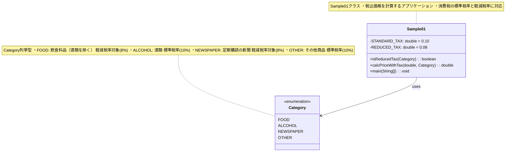

# クラス図



## クラス詳細

### Sample01クラス

#### 定数
| 定数名 | 型 | 値 | 説明 |
|--------|----|----|------|
| STANDARD_TAX | double | 0.10 | 標準税率（10%） |
| REDUCED_TAX | double | 0.08 | 軽減税率（8%） |

#### メソッド

##### isReducedTax(Category category)
- **戻り値**: boolean
- **説明**: 指定されたカテゴリが軽減税率対象かを判定
- **処理**:
  - FOOD → true
  - NEWSPAPER → true
  - その他 → false

##### calcPriceWithTax(double price, Category category)
- **パラメータ**:
  - price: 税抜き価格（double）
  - category: 商品カテゴリ（Category）
- **戻り値**: double（税込価格）
- **説明**: 商品価格に消費税を加算した税込価格を計算
- **処理**:
  - 負の価格チェック → IllegalArgumentException発生
  - isReducedTax()で税率を決定
  - price × (1 + 税率) で計算

##### main(String[] args)
- **パラメータ**: args: コマンドライン引数
- **戻り値**: void
- **説明**: ユーザーとの対話処理のメインメソッド
- **処理**:
  1. Scannerの初期化
  2. 価格入力
  3. カテゴリ入力
  4. カテゴリバリデーション
  5. 税込価格計算
  6. 結果表示
  7. リソースのクローズ

### Category列挙型

4つの商品カテゴリを定義

| 値 | 説明 | 税率 |
|-----|------|------|
| FOOD | 飲食料品（酒類を除く） | 軽減税率 8% |
| ALCOHOL | 酒類 | 標準税率 10% |
| NEWSPAPER | 定期購読の新聞 | 軽減税率 8% |
| OTHER | その他商品 | 標準税率 10% |

## クラス関係図

```
Sample01
    ├── 定数: STANDARD_TAX, REDUCED_TAX
    ├── メソッド: isReducedTax()
    ├── メソッド: calcPriceWithTax()
    └── メソッド: main()
            └── 利用: Category
                    ├── FOOD (軽減対象)
                    ├── ALCOHOL (標準)
                    ├── NEWSPAPER (軽減対象)
                    └── OTHER (標準)
```
