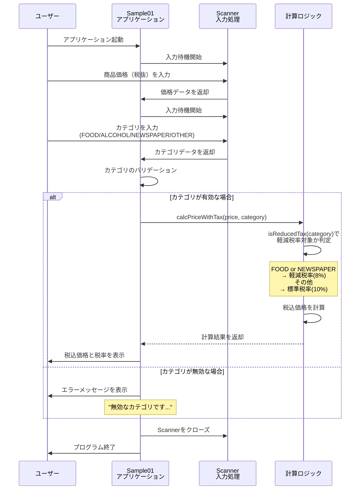

# シーケンス図 - ユーザー操作フロー

## シーケンス詳細

| ステップ | 処理内容 | 説明 |
|---------|---------|------|
| 1 | アプリケーション起動 | main()メソッドが実行される |
| 2 | 価格入力 | nextDouble()で税抜価格を入力 |
| 3 | カテゴリ入力 | next().toUpperCase()でカテゴリを入力 |
| 4 | バリデーション | Category.valueOf()でカテゴリを検証 |
| 5 | 税率判定 | isReducedTax()で軽減税率対象を判定 |
| 6 | 価格計算 | calcPriceWithTax()で税込価格を計算 |
| 7 | 結果表示 | printf()で結果を表示 |
| 8 | 終了 | Scannerをクローズしてプログラム終了 |
